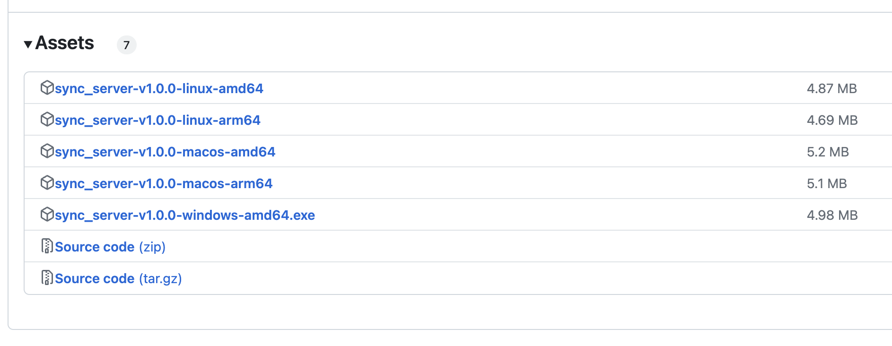

# Mobi Sync Server overview
Mobi Sync server installation is needed, because the client applications communicate with that server and send files to Mobi Sync Server. The server should be installed on a machine that is non-stop working. It supports different architectures and doesn't require a lot of resources. Mobi Sync Server is designed to use the minimum of memory, even though the uploaded files could exceed 2GB. For this reason Mobi Sync Server could be installed on a NAS, Raspberry PI ot other single-board computer, Windows core, Windows, Linux, MAC with Intel and Silicon Apple processors and other devices. The important requirement is the server to have write permissions to a disk with enough space for saving the images, photos and videos there. Follow the instructions here to setup the server.

## Installation instructions
### Download Mobi Sync Server 

* Go to the latest release in the repository and find the Assets at the end of the page
https://github.com/takecontrolsoft/sync_server/releases/latest. 
Download the latest release binary for your environment architecture.



* Set write and execute permissions to the server file.
Here is an example for linux:
```bash
  chmod +x sync_server
```

### Start Mobi Sync Server
* Create folders for storing `photos` and `logs`.

  * The folder for photos is a mandatory argument when running the server.
  * The folder for logs is optional. If it is not set the log files will be written in sync_server working directory.

* Start the server

```bash
sync_server.exe -p 3000 -d /photos/ -l /log/ -n 5
```

the parameters are:
  * `-p` - TCP port number on witch the sync server can be reached. Defaults to 8080.
  * `-d` - Storage path location for the synced files. It is mandatory.
        This value should point to the root directory where the uploaded files to be stored.
        Absolute path is required in DOS or UNC format.
        Make sure the server process has read/write access to this location.
  * `-l` - Path location for the log files. 
        If not set, the log files will be stored to the executable file location.
        Absolute path is required in DOS or UNC format.
        Make sure the server process has read/write access to this location.
  * `-n` - Log level. 
        If not set, the log level will be set to `Info` by default.
        Allowed values are from 0 to 6 and correspond to the [LogLevels](https://pkg.go.dev/github.com/takecontrolsoft/go_multi_log/logger/levels#LogLevel) defined is [go_multi_log](https://pkg.go.dev/github.com/takecontrolsoft/go_multi_log) package.
        

### Setup as a service
It is recommended the server to be configured to work as a service, so that it to be started again in case the host machine reboots. The service configuration depends on the server operation system.

### Send server address
Get the local network IP address of the machine and the sync server port number. Then build and send the server address to all the users so that they will configure the Server address in their Mobi Sync Client Apps on each device that need to ne synced.
An example could be: `http://192.168.1.51:3000`

